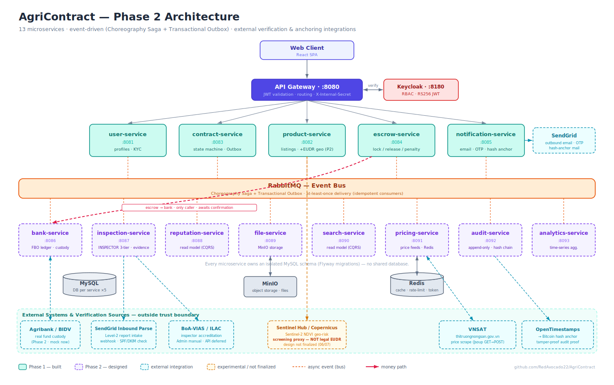
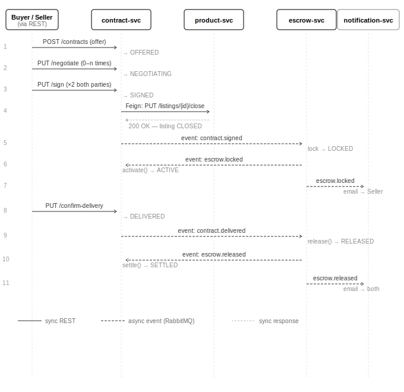

# AgriContract

> B2B agricultural contract platform with escrow for Vietnamese commodity markets.

AgriContract digitizes procurement contracts between cooperatives (HTX) and trading companies — adding a self-enforcing escrow layer that aligns both parties' incentives before a transaction happens, not just after a dispute occurs.

## The Problem

Vietnam's agricultural export sector reached **$70 billion USD in 2025**, yet B2B transactions still rely on verbal agreements and informal contracts. Three structural failures make this dangerous:

1. **Contract breaking (bẻ kèo)** — Contracts are signed 3–6 months before harvest. When commodity prices spike (e.g., Robusta coffee doubled in 2024), sellers walk away from contracts with no enforceable consequence. The CEO of Phuc Sinh Group confirmed a "large" rate of contract defaults during the 2024 coffee price surge, forcing companies to cut business plans by 15–20%.

2. **Slow dispute resolution** — Agricultural goods spoil. Vietnam's commercial courts take 1–3 years. VIAC recorded a record 475 disputes in 2024, with goods trading as the largest category. Every day of delay is unrecoverable loss.

3. **Power asymmetry** — 90% of Mekong Delta rice is sold through intermediaries. Small cooperatives have no market information, no legal resources, and no credit history — 57% of Vietnamese SMEs cannot access formal financing (We-Fi/OCB, 2022).

## Solution

AgriContract adds a **contract + escrow layer** to B2B commodity transactions:

- Buyer and Seller negotiate and sign a digital contract on-platform
- Buyer locks payment in escrow before delivery begins
- Escrow releases automatically upon delivery confirmation, or triggers penalty logic on cancellation
- Every action is timestamped and immutable — a full audit trail for compliance and future bank credit assessment

**Phase 1 (current)** delivers the full MVP flow: listing → contract signing → escrow lock → delivery → escrow release + email notifications.

**Phase 2 (thesis target)** adds: milestone-based partial payments, INSPECTOR role for independent quality verification, tiered dispute resolution, reputation scoring, and exportable audit trails for EUDR compliance and bank credit profiling.

## Architecture



5 microservices behind an API Gateway, communicating via RabbitMQ (Saga + Outbox pattern):

| Service | Port | Responsibility |
|---|---|---|
| api-gateway | 8080 | JWT validation (Keycloak), routing, internal secret injection |
| user-service | 8081 | User profiles, organization data |
| product-service | 8082 | Commodity listings |
| contract-service | 8083 | Contract lifecycle state machine, Outbox Poller |
| escrow-service | 8084 | Escrow lock/release/penalty |
| notification-service | 8085 | Email notifications via MailHog |

**Infrastructure:**

| Service | Port | Purpose |
|---|---|---|
| Keycloak | 8180 | Authentication & authorization |
| RabbitMQ | 5672 / 15672 | Async messaging (management UI on 15672) |
| MailHog | 8025 | Email catcher for dev (SMTP on 1025) |
| MySQL × 5 | 3307–3311 | One isolated DB per service |

## Happy Path



## Getting Started

### Prerequisites

- [Docker](https://docs.docker.com/get-docker/) + [Docker Compose](https://docs.docker.com/compose/install/) (no Java or Maven needed locally)

### 1. Clone and configure

```bash
git clone https://github.com/RedAvocado22/AgriContract.git
cd AgriContract
cp .env.example .env
```

Edit `.env` if you want to change passwords — defaults work out of the box for local dev.

### 2. Start all services

```bash
docker compose up --build
```

First build downloads Maven dependencies and compiles all services (~5–10 minutes). Subsequent builds with unchanged `pom.xml` are ~30 seconds per service.

### 3. Set up Keycloak

Once Keycloak is healthy at http://localhost:8180:

1. Log in with `admin` / `admin` (or whatever you set in `.env`)
2. Go to **Realm settings** → **Import realm**
3. Upload `infra/keycloak/agricontract-realm.json`

This creates the `agricontract` realm with pre-configured clients and roles (`BUYER`, `SELLER`, `ADMIN`).

### 4. Verify

| URL | What |
|---|---|
| http://localhost:8080 | API Gateway |
| http://localhost:8180 | Keycloak admin console |
| http://localhost:15672 | RabbitMQ management (guest/guest) |
| http://localhost:8025 | MailHog — outgoing emails |

API docs (Swagger UI) for each service:

- http://localhost:8081/swagger-ui.html — user-service
- http://localhost:8082/swagger-ui.html — product-service
- http://localhost:8083/swagger-ui.html — contract-service
- http://localhost:8084/swagger-ui.html — escrow-service

## Contract State Machine

```
OFFERED → SIGNED → DELIVERED → SETTLED
                ↓              ↓
            CANCELLED      DISPUTED → SETTLED / CANCELLED
```

- `cancel()` only from `ACTIVE` (post-sign)
- `dispute()` only from `DELIVERED`, buyer only
- Cancellation triggers penalty: cancelling party loses their deposit to the other side

## Tech Stack

- **Java 21** / Spring Boot 3.3
- **Spring Cloud Gateway** — API gateway
- **Spring Security** — JWT (Keycloak RS256)
- **Spring Data JPA** + Flyway — per-service MySQL schema
- **RabbitMQ** — async events (Saga + Transactional Outbox)
- **Keycloak 24** — identity provider
- **Docker** + Docker Compose — local orchestration
