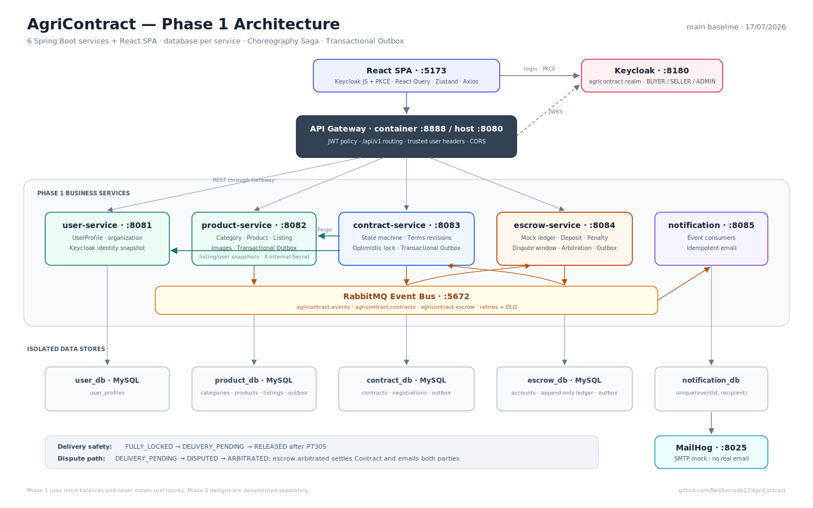

# AgriContract

AgriContract is a B2B agricultural contract platform for Vietnamese cooperatives and buyers. The Phase 1 implementation covers the complete marketplace and contract lifecycle: listing, offer, negotiation, dual signing, two-party escrow, delivery confirmation, cancellation penalties, dispute holding, admin arbitration, and email notifications.

The current runnable system consists of six Java services plus a React SPA. Phase 2 is a separate design track and is not required to run Phase 1.

## Project status

| Scope | Status |
|---|---|
| Phase 1 backend, frontend, migrations, tests, and local Docker stack | Built on `main` |
| Phase 1 happy path, cancellation, dispute, and arbitration flows | Covered by frontend and Bruno E2E suites |
| Phase 2 services and production extensions | Design documents only; see [`docs/phase_2`](docs/phase_2/) |

The code-aligned Phase 1 reference is [`docs/PHASE_1_IMPLEMENTATION.md`](docs/PHASE_1_IMPLEMENTATION.md). It supersedes older Phase 1 design assumptions when they conflict with the implementation.

## Phase 1 capabilities

- Public product and active-listing marketplace.
- Keycloak login with `BUYER`, `SELLER`, and `ADMIN` roles; first-login profile registration.
- Seller product creation with approved category and one to five image URLs, followed by listing creation.
- Buyer offer creation, counter-offers, immutable terms-revision history, and two-party signing.
- Automatic buyer-payment lock after signing and explicit seller-deposit confirmation before activation.
- Automatic cancellation penalties while a contract is `ACTIVE`.
- Delivery confirmation followed by a configurable dispute window (30 seconds locally) before automatic escrow release.
- Buyer dispute during that window, escrow hold, admin allocation, contract settlement, and arbitration-result emails.
- Role-aware React routes, API error feedback, component tests, and real-stack Playwright flows.

## Architecture



| Component | Container port | Default host access | Responsibility |
|---|---:|---:|---|
| frontend | 5173 | 5173 | React 19 SPA, Keycloak JS, TanStack Query, Zustand |
| api-gateway | 8888 | 8080 | JWT validation, public-route policy, routing, trusted user-context headers |
| user-service | 8081 | Internal | User profiles and role snapshot from Keycloak |
| product-service | 8082 | Internal | Categories, products, images, and listings |
| contract-service | 8083 | Internal | Contract state machine, terms revisions, transactional outbox |
| escrow-service | 8084 | Internal | Two-party mock escrow, append-only transactions, delayed release, arbitration |
| notification-service | 8085 | 8085 | Idempotent email delivery through MailHog |

The optional [`backend/docker-compose.override.yml`](backend/docker-compose.override.yml) exposes ports 8081–8084 for direct service development and Bruno tests. Normal browser traffic goes through the gateway on port 8080.

### Infrastructure

- Keycloak 24 on `http://localhost:8180`
- RabbitMQ 3.13 on ports 5672 and 15672
- Five isolated MySQL 8 databases on host ports 3307–3311
- MailHog SMTP on 1025 and web UI on `http://localhost:8025`

## Domain flow

| Step | Action | Contract | Escrow |
|---:|---|---|---|
| 1 | Seller creates a product and listing | — | — |
| 2 | Buyer creates an offer | `OFFERED` | — |
| 3 | Either party counter-offers; each revision is retained | `NEGOTIATING` | — |
| 4 | Both parties sign the same revision | `SIGNED` | `BUYER_LOCKED` |
| 5 | Seller confirms its deposit | `ACTIVE` | `FULLY_LOCKED` |
| 6 | Buyer confirms receipt | `DELIVERED` | `DELIVERY_PENDING` |
| 7a | No dispute before the configured deadline | `SETTLED` | `RELEASED` |
| 7b | Buyer disputes, then Admin allocates the held funds | `DISPUTED → SETTLED` | `DISPUTED → ARBITRATED` |

Cancellation is accepted only while the contract is `ACTIVE`. Buyer cancellation applies `buyerPenaltyRate`; seller cancellation refunds the buyer payment and transfers the seller deposit as the seller penalty.

## Consistency and security

- `product-service`, `contract-service`, and `escrow-service` write outgoing domain events to an outbox table in the same database transaction as aggregate changes. Pollers publish pending events every second.
- Contract and escrow rows use optimistic locking to protect concurrent state transitions, including the delivery-release/dispute race.
- Contract creation supports caller-provided idempotency IDs; escrow creation is unique by `contractId`; notification delivery is unique by `(eventId, recipient)`.
- Escrow transactions are append-only records for locks, refunds, releases, penalties, and arbitration allocations. Phase 1 uses mock balances and never moves real money.
- Public access is limited to `GET /api/v1/products`, `GET /api/v1/listings`, and `GET /api/v1/listings/{listingId}`. Other implemented gateway routes require a valid Keycloak bearer token.
- The gateway strips the bearer token before forwarding and injects `X-User-Id`, `X-User-Email`, `X-User-Role`, and `X-Gateway-Secret`. Internal Feign calls use `X-Internal-Secret`.

## Tech stack

- Java 21, Spring Boot 3.3.5, Spring Cloud Gateway
- Spring Security, Keycloak, OpenFeign
- Spring Data JPA, Flyway, MySQL 8
- Spring AMQP, RabbitMQ, transactional outbox polling
- React 19, TypeScript 6, Vite 8, React Router 7
- TanStack Query, Zustand, Axios, React Hook Form, Zod
- Vitest, Testing Library, Playwright, Bruno
- Docker Compose and MailHog

## Getting started

### Prerequisites

- Docker with Docker Compose
- Node.js `^20.19.0` or `>=22.12.0` and npm for the frontend
- Optional: Java 21 and Maven 3.9+ for backend tests outside Docker

### 1. Configure the backend

```bash
git clone https://github.com/RedAvocado22/AgriContract.git
cd AgriContract
cp .env.example .env
```

Open `.env` and replace both `REPLACE_WITH_RANDOM_SECRET` values. Generate each value with:

```bash
openssl rand -hex 32
```

### 2. Start infrastructure and backend services

```bash
docker compose up --build -d
docker compose ps
```

### 3. Import the Keycloak realm

1. Open `http://localhost:8180` and sign in to the admin console with `admin` / `admin` unless changed in `.env`.
2. Create/import a realm and select [`infra/keycloak/agricontract-realm.json`](infra/keycloak/agricontract-realm.json).
3. Confirm that realm `agricontract` and client `agricontract-frontend` exist.

The imported development users all use password `pass123`:

| Username | Role |
|---|---|
| `buyer1` | BUYER |
| `seller1`, `seller2` | SELLER |
| `admin1` | ADMIN |

### 4. Start the frontend

```bash
cd frontend
cp .env.example .env
npm ci
npm run dev
```

Open `http://localhost:5173`. On first login, the SPA redirects users without a `user-service` profile to `/register-profile`.

### Local URLs

| URL | Purpose |
|---|---|
| `http://localhost:5173` | AgriContract SPA |
| `http://localhost:8080` | API Gateway |
| `http://localhost:8180` | Keycloak admin and login |
| `http://localhost:15672` | RabbitMQ management (`guest` / `guest`) |
| `http://localhost:8025` | MailHog inbox |

## Tests

Backend unit and integration tests:

```bash
mvn test
```

Frontend checks:

```bash
cd frontend
npm test
npm run lint
npm run build
```

With the backend, imported realm, and frontend already running, install the Playwright browser once and run the real-stack flows:

```bash
cd frontend
npx playwright install chromium
npm run test:e2e
```

For the Bruno contract suite, expose direct service ports and then run the reset-and-test script:

```bash
docker compose -f docker-compose.yml -f backend/docker-compose.override.yml up --build -d
./scripts/run-e2e.sh
```

The Bruno CLI (`bru`) must be available on `PATH`.

## Documentation map

- [Phase 1 implementation reference](docs/PHASE_1_IMPLEMENTATION.md)
- [Phase 1 system architecture source](docs/diagrams/01-architecture.puml)
- [Phase 1 happy-path sequence](docs/diagrams/02-sequence-happy-path.puml)
- [Phase 1 cancel and dispute sequence](docs/diagrams/03-sequence-cancel-and-dispute.puml)
- [Phase 1 Word document builder](docs/phase_1/files/README.md)
- [Frontend development guide](frontend/README.md)
- [Phase 2 design documents](docs/phase_2/)
